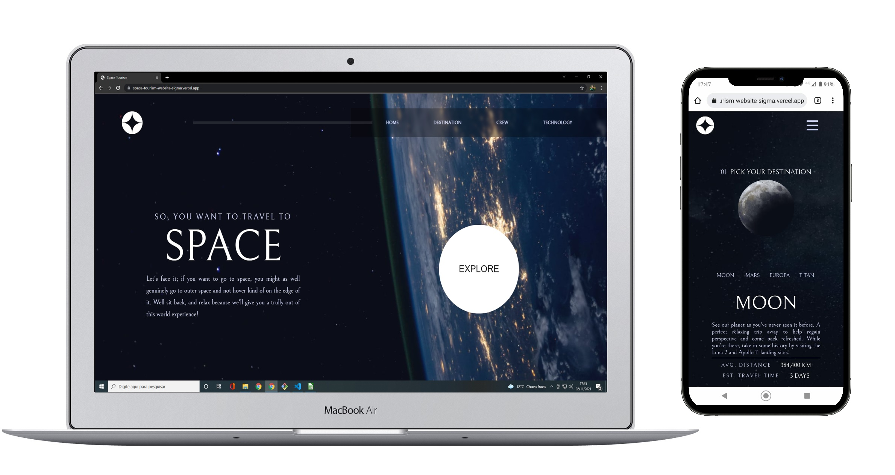
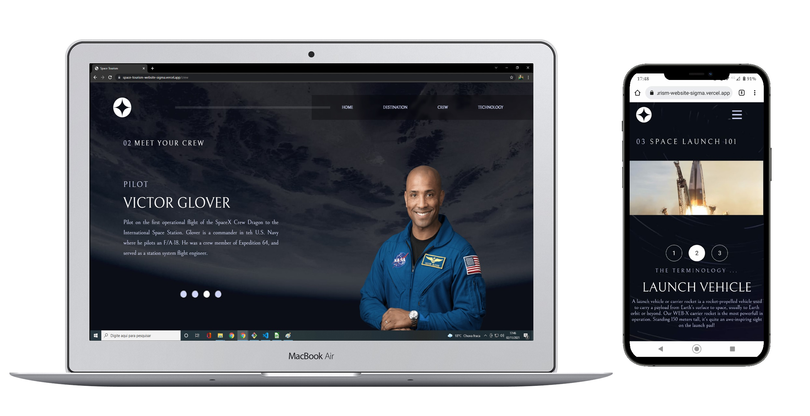

# Space Tourism Website

This is a Space Tourism website. Based in a challenge of [Frontend Mentor](https://www.frontendmentor.io/challenges/space-tourism-multipage-website-gRWj1URZ3)

## Table of contents

- [Space Tourism Website](#space-tourism-website)
  - [Table of contents](#table-of-contents)
  - [Overview](#overview)
    - [The challenge](#the-challenge)
    - [Screnshot](#screnshot)
    - [Links](#links)
  - [My process](#my-process)
    - [Built with](#built-with)
    - [What I learn](#what-i-learn)
  - [Author](#author)
    - [Get in touch](#get-in-touch)

## Overview

### The challenge

Users should be able to:

- View the optimal layout for desktop and mobile screen size
- See hover states for all interactive elements on the page
- See all the topics of the pages

### Screnshot

### Links

- Enjoy my project: [Space Tourism](https://space-tourism-website-sigma.vercel.app/)

## My process

### Built with

- HTML5
- CSS3
- Javascript
- React
- Deploy with Vercel

### What I learn

  I put into practice my knowledge of HTML5 and Javascript using React. I improved my skills in CSS3 using @media-queries, flex-box and another things.

## Author

### Get in touch
- Portfolio - [Gabriel Moura](https://gcmoura-portfolio.netlify.app/)
- Linkedin - [Gabriel Moura](https://www.linkedin.com/in/gabriel-moura-developer/)
- Github - [@GCMoura](https://github.com/GCMoura)